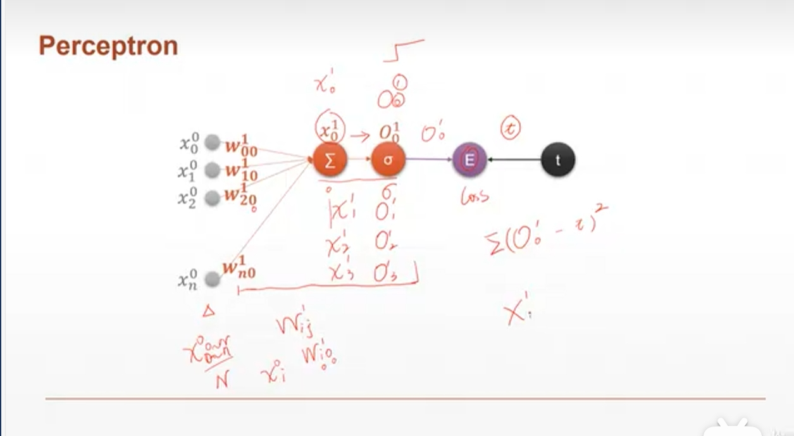
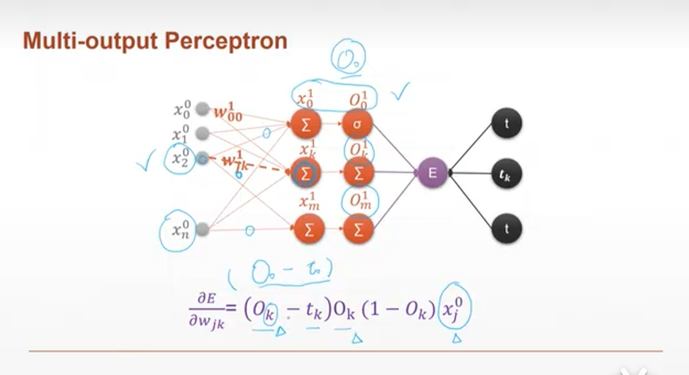
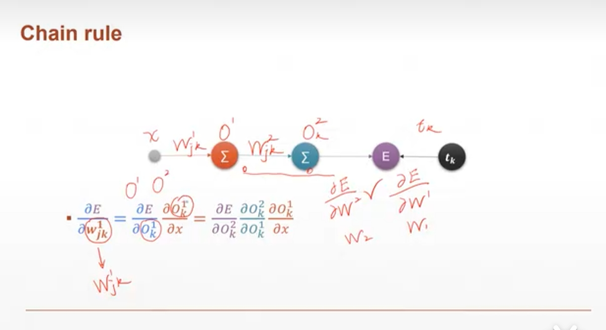

# Perceptron Gradient 感知器梯度

## 单输出感知器模型



- 对感知器需要求对所有`w`的梯度

### 代码演示1

```Python
w = torch.randn(1,10,requires_grad=True)
x = torch.randn(1,10)
#生成w和x的参数

o = torch.sigmoid(x @ w.t())
# 计算乘积求和并使用sigmoid函数

loss = F.mse_loss(torch.tensor([[1.]]),o)
loss.backward()
# 对loss进行反向传播
# 如果要多次求梯度需要设置参数：
# loss.backward(retain_graph=True)

w.grad
Out[34]: 
tensor([[-0.0166,  0.3570, -0.2438, -0.2557,  0.0259, -0.1971, -0.1385, -0.2513,
         -0.3493,  0.1285]])
```

## 多输出感知器模型



### 代码演示2

```Python
x = torch.randn(1,10)
w = torch.randn(2,10,requires_grad=True)
# 生成测试数据

o = torch.sigmoid(x @ w.t())
o.shape
Out[7]: torch.Size([1, 2])
# 预测输出

loss = F.mse_loss(torch.ones(1,2),o)
loss
Out[10]: tensor(0.0197, grad_fn=<MseLossBackward0>)
# 生成loss

loss.backward()
# 反向传播（梯度求解）
w.grad
Out[12]: 
tensor([[ 0.0093,  0.0083, -0.0037, -0.0071,  0.0031,  0.0157, -0.0077, -0.0012,
          0.0146,  0.0101],
        [ 0.0181,  0.0162, -0.0072, -0.0140,  0.0061,  0.0308, -0.0150, -0.0023,
          0.0286,  0.0199]])
```

## 链式法则



```Python
x = torch.tensor(1.)
w1 = torch.tensor(2.,requires_grad=True)
b1=torch.tensor(1.)
w2=torch.tensor(2.,requires_grad=True)
b2=torch.tensor(1.)
y1 = x * w1 + b1
y2 = y1 * w2 + b2
# 数据准备

dy2_dy1 = torch.autograd.grad(y2,[y1],retain_graph=True)[0]
dy2_dw1 = torch.autograd.grad(y2,[w1],retain_graph=True)[0]
dy1_dw1 = torch.autograd.grad(y1,[w1],retain_graph=True)[0]
dy2_dw1 * dy1_dw1
Out[23]: tensor(2.)
# 链式求解梯度

dy2_dw1
Out[24]: tensor(2.)
# 直接求解梯度
```
