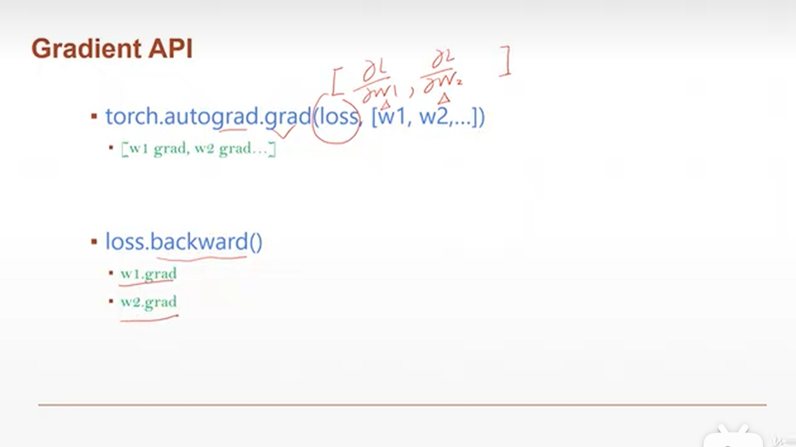

# Gradient API 梯度API

## CATALOG

1. [Gradient API 梯度API](#gradient-api-梯度api)
   1. [CATALOG](#catalog)
   2. [Autograd.grad](#autogradgrad)
      1. [1.数据准备](#1数据准备)
      2. [2.`mse_loss()`误差计算](#2mse_loss误差计算)
      3. [3.梯度计算](#3梯度计算)
         1. [3.1.`Autograd.grad()`手动计算梯度](#31autogradgrad手动计算梯度)
         2. [3.2`loss.backword()`向后传播计算梯度](#32lossbackword向后传播计算梯度)
   3. [Softmax](#softmax)
      1. [1.`softmax()`的使用](#1softmax的使用)

## Autograd.grad

- 假设求`pred = w * x`的回归方程

### 1.数据准备

```Python
import torch
import torch.nn.functional as F

x = torch.ones(1)
Out[5]: tensor([1.])

w = torch.full([1],2.)
w.requires_grad_() # 执行这一步表明对w参数需要梯度信息
```

### 2.`mse_loss()`误差计算

- `mse = F.mse_loss(torch.ones(1), x * w)` 计算了目标值`torch.ones(1)`（即1）和预测值`x * w`之间的均方误差。均方误差是预测误差的平方的平均值，这里只有一个预测值，所以直接计算了`(1 - (x * w))^2`。

- 并且这个张量有一个梯度函数`<MseLossBackward0>`，表示它是通过MseLoss操作得到的，因此可以对其进行梯度计算。

```Python
mse = F.mse_loss(torch.ones(1),x * w)
# 完成动态图的建图

Out[16]: tensor(1., grad_fn=<MseLossBackward0>)
```

### 3.梯度计算



#### 3.1.`Autograd.grad()`手动计算梯度

```Python
torch.autograd.grad(mse,[w])
Out[17]: (tensor([2.]),)
# mse可以视为关于w参数的函数，并对w参数进行求导（梯度）
```

#### 3.2`loss.backword()`向后传播计算梯度

```Python
mse = F.mse_loss(torch.ones(1),x * w)
mse.backward()
# 自动计算对于w的梯度

w.grad # 查看w的梯度
Out[21]: tensor([2.])
```

## Softmax

> `softmax()`函数在机器学习和深度学习中是一个非常重要的函数，主要用于多分类问题的输出层。它可以将一个含任意实数的K维向量`z`（`z`中的每一个元素可以看作是某一类别的未归一化的对数概率）压缩到另一个K维向量`σ(z)`中，使得每一个元素的范围都在(0, 1)之间，并且所有元素的和为1。

> 这种转换可以使得输出向量`σ(z)`可以解释为概率分布，即`σ(z)`中的每一个元素都可以被看作是对应类别的概率。

`softmax`函数的数学表达式为：

$$
\sigma(z)_j = \frac{e^{z_j}}{\sum_{k=1}^{K} e^{z_k}} \quad \text{for } j = 1, ..., K
$$

> 其中，$z$是输入向量，$K$是类别的数量，$z_j$是输入向量$z$中对应于第$j$个类别的元素，$\sigma(z)_j$是输出向量$\sigma(z)$中对应于第$j$个类别的元素（即经过softmax函数处理后的概率）。

> 在深度学习中，`softmax`函数经常与交叉熵损失函数（cross-entropy loss）一起使用，以训练多分类问题的模型。`softmax`函数确保了模型的输出可以解释为概率分布，而交叉熵损失函数则评估了模型预测的概率分布与真实标签之间的差异，从而指导模型的训练过程。

***简单来说，`softmax`函数的作用就是：将分类问题的输出转换为概率分布。***

### 1.`softmax()`的使用

```Python
a = torch.rand(3)
a.requires_grad_()
Out[40]: tensor([0.7728, 0.4713, 0.9653], requires_grad=True)

p=F.softmax(a,dim=0)
# 对a张量进行softmax操作

torch.autograd.grad(p[1],[a],retain_graph=True)
Out[42]: (tensor([-0.0849,  0.1878, -0.1029]),)
# 对每个自变量求梯度

torch.autograd.grad(p[2],[a],retain_graph=True)
Out[43]: (tensor([-0.1391, -0.1029,  0.2420]),)
```